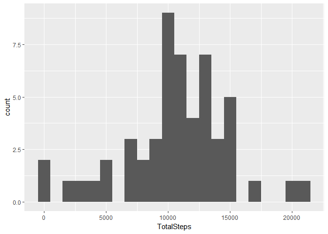
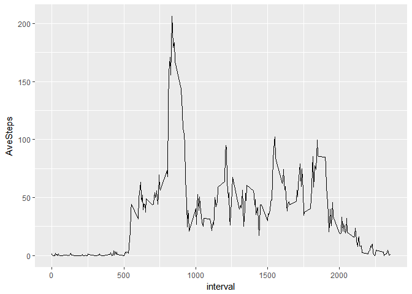
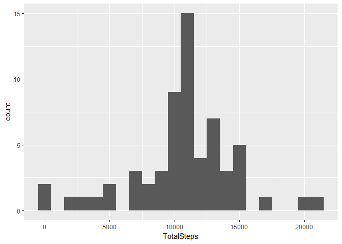
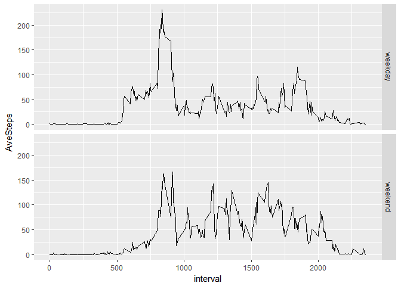

# Reproducible Research: Peer Assessment 1


## Loading and preprocessing the data

```r
library("dplyr")
```

```
## 
## Attaching package: 'dplyr'
```

```
## The following objects are masked from 'package:stats':
## 
##     filter, lag
```

```
## The following objects are masked from 'package:base':
## 
##     intersect, setdiff, setequal, union
```

```r
temp <- tempfile()
download.file("https://d396qusza40orc.cloudfront.net/repdata%2Fdata%2Factivity.zip",temp)
act <- read.csv(unz(temp, "activity.csv"), stringsAsFactors = FALSE)
act <- tbl_df(act)
unlink(temp)

act$date <- as.Date(act$date, tz="America")
```


## What is mean total number of steps taken per day?
1.Calculate the total number of steps taken per day

```r
library("dplyr")
act2 <- act %>% group_by(date) %>% summarise(TotalSteps=sum(steps))
```

2.Make a histogram of the total number of steps taken each day

```r
library("ggplot2")
ggplot(act2, aes(TotalSteps)) +
geom_histogram(binwidth=1000)
```

```
## Warning: Removed 8 rows containing non-finite values (stat_bin).
```

<!-- -->

3.Calculate and report the mean and median of the total number of steps taken per day

```r
mean(act2$TotalSteps, na.rm = TRUE)
```

```
## [1] 10766.19
```

```r
median(act2$TotalSteps, na.rm = TRUE)
```

```
## [1] 10765
```

## What is the average daily activity pattern?
1.Make a time series plot of the 5-minute interval (x-axis) 
and the average number of steps taken, averaged across all days (y-axis)

```r
act3 <- act %>% group_by(interval) %>% summarise(AveSteps=mean(steps, na.rm = TRUE))
ggplot(act3, aes(interval, AveSteps)) +
  geom_line()
```

<!-- -->

2.Which 5-minute interval, on average across all the days in the dataset, 
contains the maximum number of steps?

```r
maxrow <- filter(act3, AveSteps==max(act3$AveSteps))
maxrow[,1]
```

```
## # A tibble: 1 x 1
##   interval
##      <int>
## 1      835
```


## Imputing missing values
1.Calculate and report the total number of missing values in the dataset

```r
sum(is.na(act))
```

```
## [1] 2304
```

2,3.Create a new dataset that is equal to the original dataset but with the missing data filled in.

```r
act4 <- act %>% merge(act3,by="interval") %>% arrange(date) 
act4$steps[is.na(act4$steps)] <- act4$AveSteps[is.na(act4$steps)]
act4 <- act4 %>% select(-AveSteps) 
```

4.Make a histogram of the total number of steps taken each day
and Calculate and report the mean and median total number of steps taken per day. 

```r
act4_2 <- act4 %>% group_by(date) %>% summarise(TotalSteps=sum(steps))
ggplot(act4_2, aes(TotalSteps)) +
  geom_histogram(binwidth=1000)
```

<!-- -->

```r
mean(act4_2$TotalSteps, na.rm = TRUE)
```

```
## [1] 10766.19
```

```r
median(act4_2$TotalSteps, na.rm = TRUE)
```

```
## [1] 10766.19
```
These values differ from the estimates from the first part of the assignment,
The impact of imputing missing data on the estimates of the total daily number of steps is small

## Are there differences in activity patterns between weekdays and weekends?
1.Create a new factor variable in the dataset with two levels ??? “weekday” 
and “weekend” indicating whether a given date is a weekday or weekend day.

```r
act5 <- act4 %>% mutate(day=weekdays(date)) %>%
  mutate(day=gsub("月曜日", "weekday", day)) %>%  
  mutate(day=gsub("火曜日", "weekday", day)) %>%  
  mutate(day=gsub("水曜日", "weekday", day)) %>%  
  mutate(day=gsub("木曜日", "weekday", day)) %>%  
  mutate(day=gsub("金曜日", "weekday", day)) %>%  
  mutate(day=gsub("土曜日", "weekend", day)) %>%  
  mutate(day=gsub("日曜日", "weekend", day)) 
```
2.Make a panel plot containing a time series plot of the 5-minute interval (x-axis) 
and the average number of steps taken, averaged across all weekday days or weekend days (y-axis). 

```r
act6 <- act5 %>% group_by(day,interval) %>% summarise(AveSteps=mean(steps, na.rm = TRUE))
ggplot(act6, aes(interval, AveSteps)) +
  geom_line()+facet_grid(day~.)
```

<!-- -->
